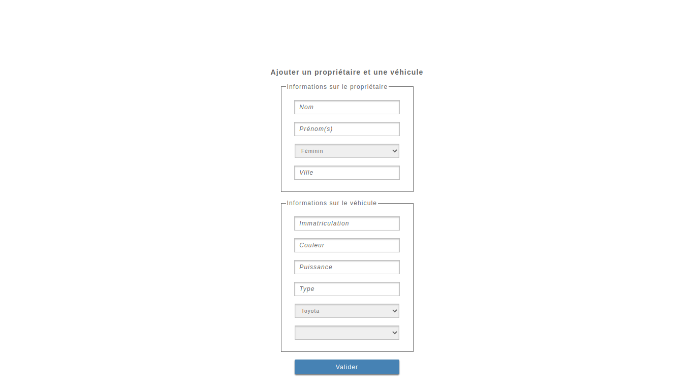
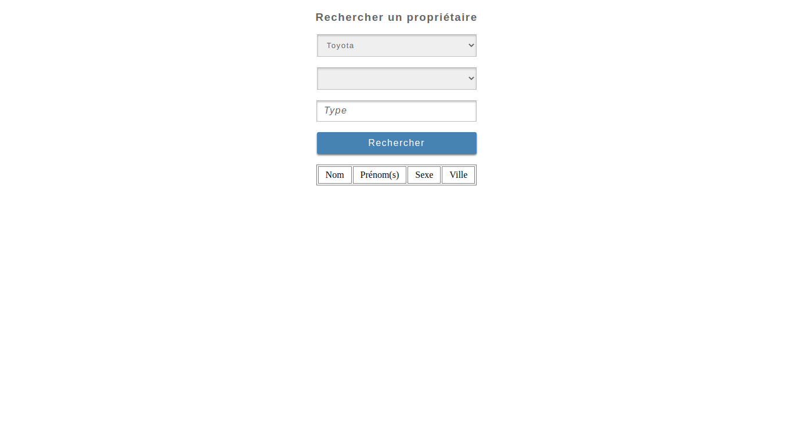
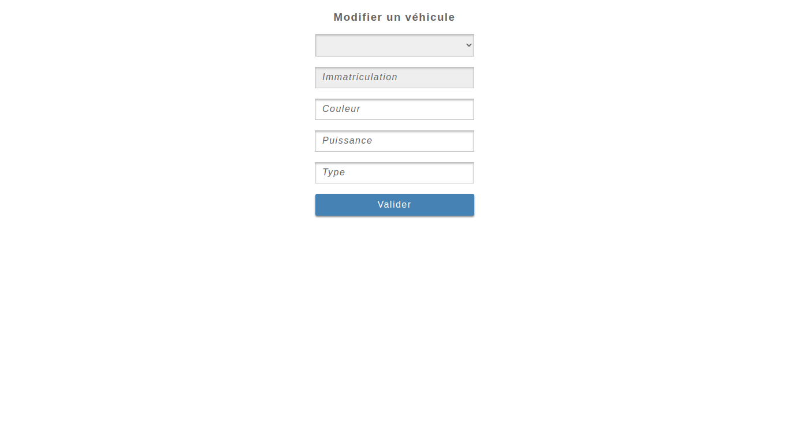
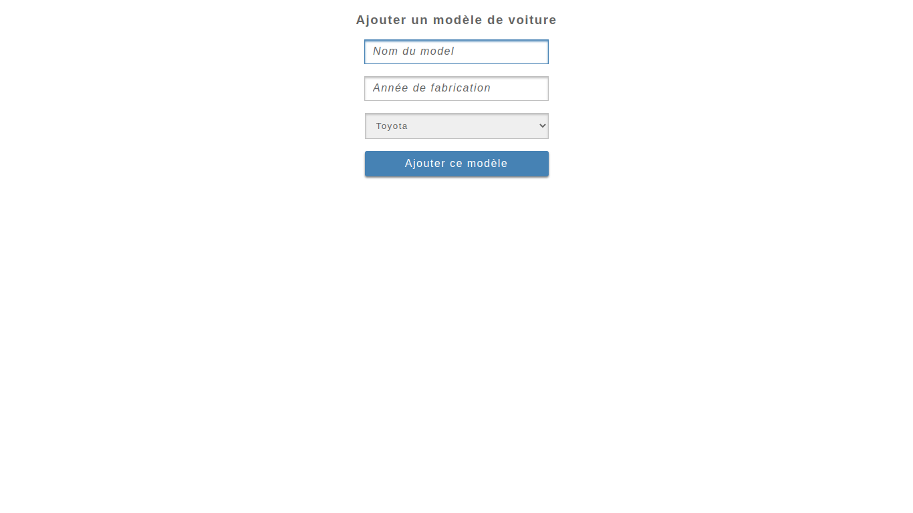

# Simple Cars Saver


This small project is an academy project. The main goal of this app is to be able to save owners's cars.

## Final result
This is the final result of the project:<br/><br/>





## Project installation

### <u>Install XAMPP or WAMP</u>:
- For XAMPP downloading, you can find it at this link: <a href = "https://www.apachefriends.org/fr/download.html">https://www.apachefriends.org/fr/download.html</a>
- For WAMP downloading, you can find it at this link: <a href = "https://www.wampserver.com/en">https://www.wampserver.com/en/</a>

### <u>Project cloning</u>:
```sh
git clone https://github.com/obrymec/Simple-Cars-Saver simple-cars-saver/
```

### <u>Tasks before run the project</u>:
After you clone the project, you should do the following tasks before run it:
- Move the project folder to your Wampp or Xampp server folder;
- Turn on your Wampp or Xampp server;
- Go to phpMyAdmin in your favorite browser or via the link: http://localhost/phpmyadmin/
- Create a database named exactly like this: <i style = "color: skyblue;">cars_saver</i>;
- Select the newly created database;
- Click on the <i style = "color: skyblue;">Import</i> tab at the top;
- Click on the <i style = "color: skyblue;">Choose a file</i> button in the <i style = "color: skyblue;">File to import</i> section;
- Load the file <i style = "color: skyblue;">tables.sql</i> located at the root of the project;
- Then click on the <i style = "color: skyblue;">Import</i> button located at the very bottom of the page.<br/>
After this operation, you will see that tables have been automatically created in your database named <i style = "color: skyblue;">cars_saver</i>.
- Select the <i style = "color: skyblue;">marque</i> table and fill it with the brands of your choice.<br/>
Now you are ready to run the project.

### <u>Run project</u>:
To navigate between project views, you can uses the following below links:
- http://localhost/simple-cars-saver/_listeProprietaire.html
- http://localhost/simple-cars-saver/ajoutVehiPropri.html
- http://localhost/simple-cars-saver/ModifVehicule.html
- http://localhost/simple-cars-saver/AjoutModele.html

<u><strong>NB</strong></u>: Make sure that the project folder name is: <i style = "color: skyblue;"><strong>simple-cars-saver</i></strong>

Enjoy :)
